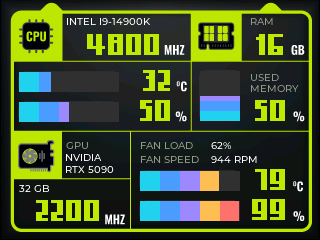

# PC Monitor

Keep your PC's temperature, load and memory use in view on MeowKit.
Connect a USB data cable, start HardwareSerialMonitor on Windows, and open
**Apps > PC Monitor**.



Actual LVGL host render at 320 × 240, using illustrative values from the design
reference. This preview is not an on-device test or a hardware-support claim.

## Windows client

[Download HardwareSerialMonitor for MeowKit](../software/HardwareSerialMonitor/downloads/HardwareSerialMonitor-v1.4.4-MeowKit.zip)

Extract the complete ZIP, run `HardwareSerialMonitor.exe` as administrator,
and choose MeowKit's COM port from its Windows notification-area menu.
Check hidden tray icons if you do not see it. The client uses .NET Framework 4.8
and 9600 baud, 8 data bits, no parity, 1 stop bit.

Use MeowKit in normal operating mode. Download mode is only for firmware
flashing. Close any serial monitor using the same COM port.

The package includes the original v1.4.4 program, runtime dependencies,
matching-version source project and license. See
[client setup and build instructions](../software/HardwareSerialMonitor/README.md).

## Read the screen

The upper-left panel shows the CPU model, clock speed in MHz, temperature and
load. The upper-right panel shows total RAM in GB and memory use in percent.
The lower panel shows the GPU model, VRAM, clock speed, fan load, fan RPM,
temperature and load. Long CPU and GPU model names scroll within their panels.

All five meters follow received data. Load and RAM meters use 0–100%; temperature
meters use 0–100 degrees Celsius and cap visually at 100, while the numeric value
can exceed it. Horizontal meters reveal five fixed color segments as values rise.
The RAM meter uses the same cyan, blue, violet, amber and coral palette, filling
from bottom to top in five 20% segments.
These colors are visual guides, not hardware-specific alarm limits. Large numbers
use a smaller font when needed to keep the units readable.

- **Connect USB – start the PC client:** waiting for the first complete sample.
- **Live monitoring:** values update; the connection prompt is hidden.
- **Data stopped:** no complete packet for five seconds; old readings are cleared.
- **--:** the client did not provide a usable value for that field.

Hold **B** to exit. The client can stay open on Windows.

## Troubleshooting

If all values are missing, check the cable, selected COM port and client tray
icon. Close other applications using that port. Reselect the port after
reconnecting if Windows assigned a different one.

If only a temperature or GPU reading is missing, check client permissions and
hardware support. This legacy sensor library may not recognize newer hardware.
The MeowKit display cannot generate a reading that the client does not send.

## Source map

| Path | Purpose |
| --- | --- |
| `src/app/app_05/pc_monitor.cpp` | App lifecycle, serial receive, display updates and stale-data state |
| `src/app/app_05/pc_monitor_protocol.h` | Fixed-size, host-testable HSM parser |
| `src/app/app_05/pc_monitor_view.cpp` | Shared firmware/host-test presentation of decoded values |
| `src/app/app_05/asset/ui_PC_Monitor.c` | Native LVGL 320 × 240 layout |
| `src/app/app_05/asset/pc_monitor_images.c` | Generated const Flash image data |
| `tools/embed_pc_monitor_assets.ps1` | Rebuild image data from the two original PNGs |
| `software/HardwareSerialMonitor/source/` | Vendored Windows project and resources |
| `software/HardwareSerialMonitor/downloads/` | User download ZIP including source |
| `test/pc_monitor_protocol_test.cpp` | Protocol regression tests |
| `test/pc_monitor_ui/` | Real LVGL host rendering and lifecycle checks |

The app does not read images from an SD card. `pc_monitor_bg.png` is placed at
(0, 0); `pc_monitor_ui_X10,Y2.png` is placed at (10, 2). Both original PNGs remain
in app05. The generated RGB565 + alpha arrays occupy 438,780 bytes in Flash and
need no PNG decoding or full-image RAM buffers during use. Live labels and meters
are layered over the artwork. The old duplicate background and gauge arrays have
been removed; shared system fonts and other applications are unchanged.

After changing either PNG, regenerate the checked-in C resource on Windows:

```powershell
powershell -NoProfile -ExecutionPolicy Bypass -File tools/embed_pc_monitor_assets.ps1
```

Ordinary firmware builds do not require this conversion step.

## Serial protocol

The supplied v1.4.4 client calls `SerialPort.WriteLine()` and uses pipe-separated
fields. A representative sample is:

```text
C36c 13%|G44c 46%|R13.8GB|RA2.2|RL86|GMT12288|GMU1000|GML8|GFANL0|GRPM0|GPWR30|CPU:Intel Core i7-7700KGPU:NVIDIA GeForce RTX 4070 SUPER|GCC2500||GMC10000||GSC0||CHC1600|
```

`C` and `G` carry temperature and load; `R` is RAM used; `RA` is RAM available.
Total RAM is their sum. `GMT` is total VRAM in MB; `CHC` is CPU clock in MHz.
`GCC` is GPU clock in MHz; `GFANL` is fan load in percent; `GRPM` is fan RPM.
These fields are optional; missing sensors display `--`, not a fabricated zero.
CPU and GPU names may share a token or arrive as separate tokens.

The receiver publishes after a newline or the next CPU sample. For clients
without a newline, it also supports a 150 ms idle gap following a delimiter.
CPU, GPU, RAM-used and RAM-available fields must all have arrived. Numeric
fields accept dot or comma decimals; unavailable, non-finite and out-of-range
values appear as `--`. Unknown fields are ignored. An overlong token invalidates
the current sample, and the next CPU sample resynchronizes reception.

Each token is limited to 255 bytes; names to 95 bytes. Reception processes at
most 512 bytes per app loop without sleeping between fields. The launcher
continues polling B while data arrives. Stale detection uses unsigned elapsed
time, including across the `millis()` wrap-around.

## Validation

Run protocol tests with a host C++17 compiler:

```powershell
g++ -std=c++17 -Wall -Wextra -pedantic test/pc_monitor_protocol_test.cpp -o output/pc_monitor_protocol_test.exe
./output/pc_monitor_protocol_test.exe
```

Render the actual LVGL screen (GCC example on Windows):

```powershell
python tools/test_pc_monitor_ui.py --cc C:/msys64/mingw64/bin/gcc.exe
```

This writes preview BMPs to ignored `output/`, renders actual decoded packets
through the firmware view code, checks normal/maximum/missing values, verifies
partial redraws against a full redraw, and opens/closes the screen 30 times.
Build the firmware with `pio run`.

Hardware acceptance after flashing:

1. Connect the supplied Windows client; compare CPU/GPU values with its source sensors.
2. With the SD card removed, check both image layers, long model names, `°C`,
   `100%`, RAM units, both clock speeds, VRAM and available fan readings.
3. Stop the client; confirm readings clear after five seconds. Restart it and
   confirm automatic recovery without restarting MeowKit.
4. Hold B while receiving data; reopen PC Monitor repeatedly and check stability.
5. Unplug/reconnect USB and test an unsupported sensor (`--`).

The maintainer has confirmed normal PC Monitor operation on hardware. Repeat
the checks above after future display or protocol changes. This source update
does not create a new firmware release.
